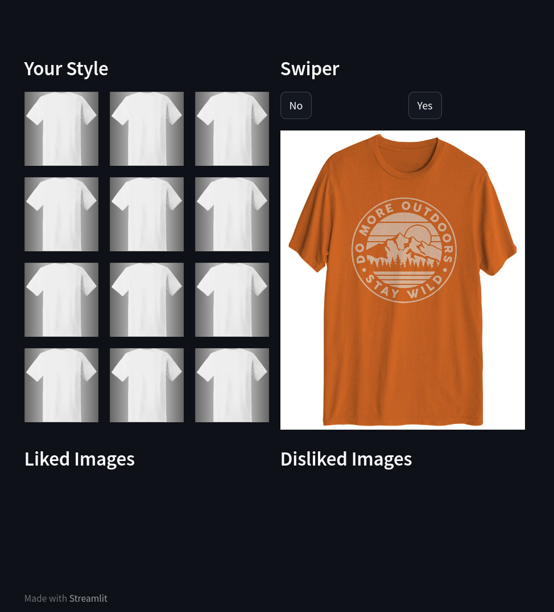
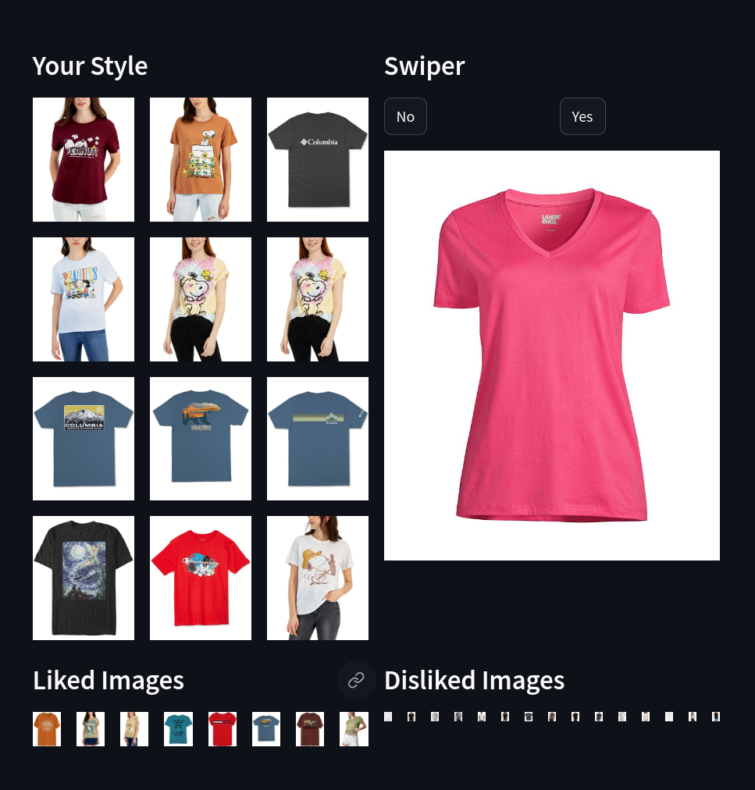
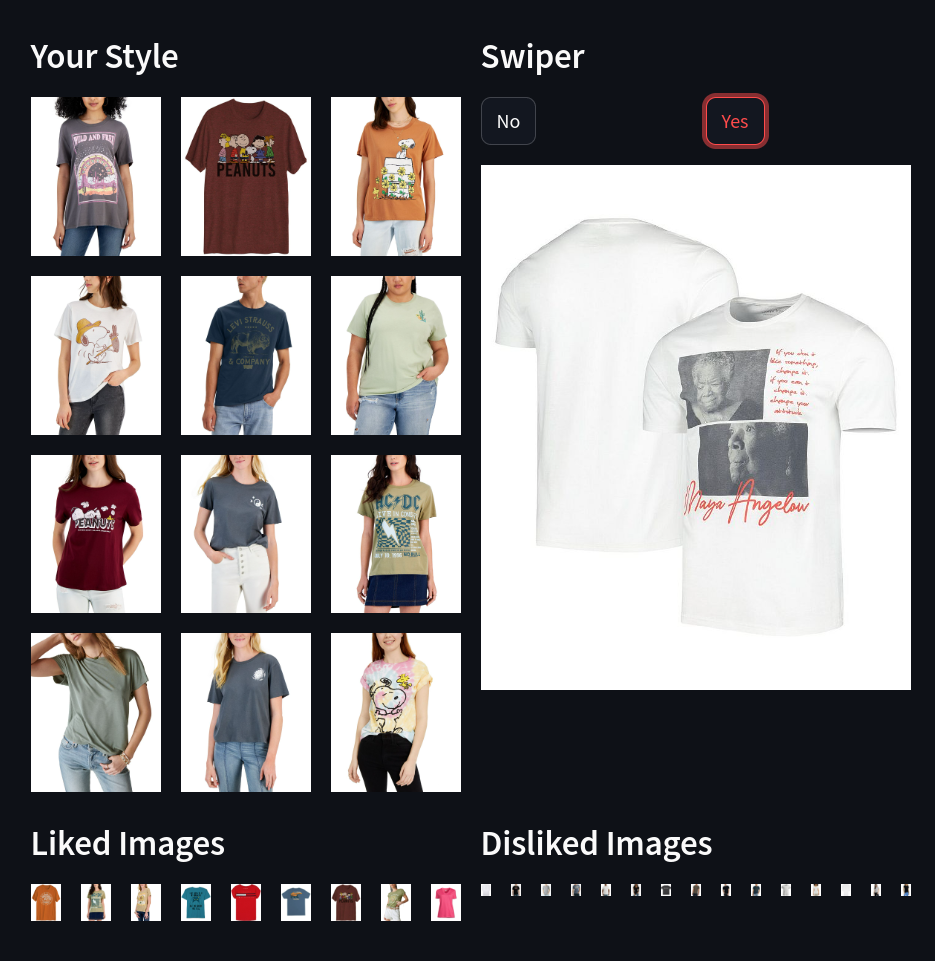

# Tinder for Fashion

Built at the personalized autonomous agents hackathon @AGI House, San Francisco.

This is a Beta version of your personalized AI powered shopping bot that takes your preferences and shows you a matrix of outfits that suit your style.

### Splash Page

*As a demonstration, we will emulate a user that likes colorful and flashy clothes*

 

#### After a Few User Responses

 

#### After More User Responses

### Authors

* **Kenny Oseleononmen** - [Kenny1G](https://github.com/Kenny1G)
* **Gautham Raghupathi** - [gurugautham](https://github.com/gurugautham)
* **Siddharth Saha** - [trunc8](https://github.com/trunc8)
* **Chris Gore** - [cdgore](https://github.com/cdgore)

Created with :heart: by <a href="https://www.linkedin.com/in/sahasiddharth611/">Kenny, Gautham, Saha, Chris</a>

